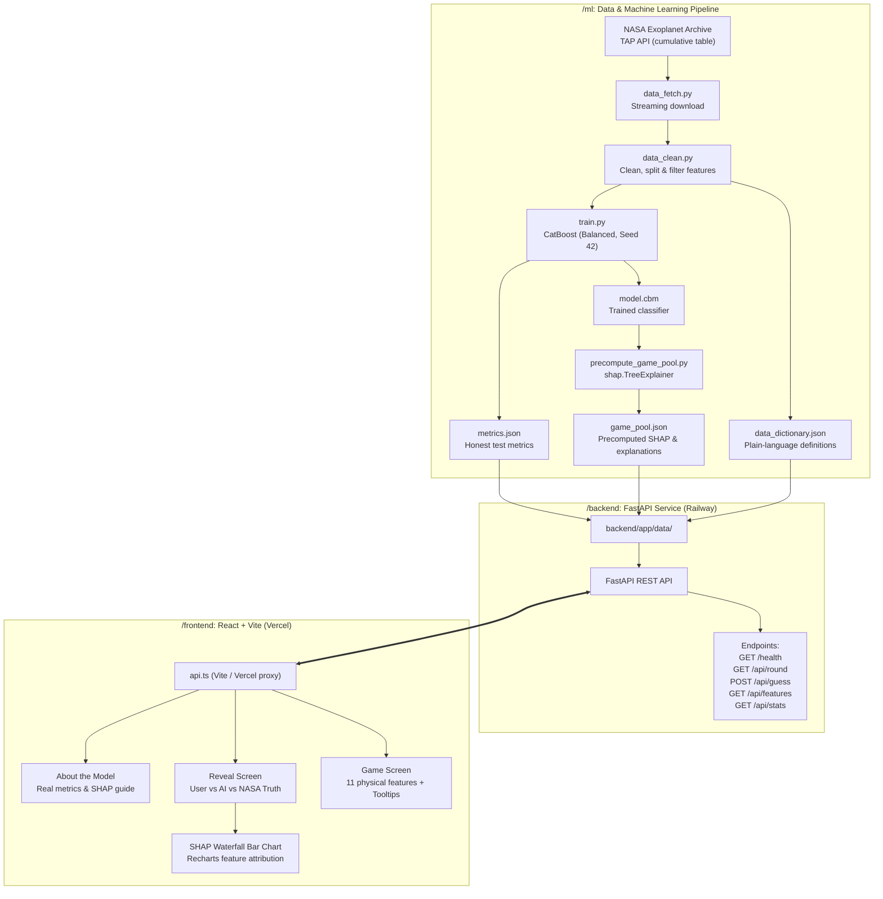

# KeplerLens: Planet or Impostor? 🪐🔭

An educational web application where users play **"Planet or Impostor?"** on real NASA Kepler candidates. Inspect a candidate's measured light-curve transit properties, decide whether it is a confirmed exoplanet or a false-positive impostor, and discover how a trained **CatBoost** machine learning model evaluates the same candidate using **SHAP (Shapley Additive Explanations)**.

Learning how transit detection works matters more than raw accuracy.

---

## Architecture

KeplerLens is structured as a clean monorepo:



### Technology Stack
- **Machine Learning (`/ml`)**: Python 3.11, CatBoost, SHAP (`TreeExplainer`), scikit-learn, pandas.
- **Backend API (`/backend`)**: FastAPI, Pydantic v2, Uvicorn, Pytest, HTTPX. (Ready for Railway via Dockerfile & Procfile).
- **Frontend SPA (`/frontend`)**: React 19, TypeScript, Vite 8, Tailwind CSS, Recharts, Lucide Icons. (Ready for Vercel via `vercel.json`).

---

## NASA Data & Astrophysical Features

Data is queried directly from the **NASA Exoplanet Archive Kepler Objects of Interest (KOI) cumulative table** via the Table Access Protocol (TAP) API:

```
https://exoplanetarchive.ipac.caltech.edu/TAP/sync?query=select+*+from+cumulative&format=csv
```

### Candidate Features (11 Physical Properties)
Only physical transit and host star properties are used:
1. `koi_period`: **Orbital Period** (days) — Time for one orbit around the host star.
2. `koi_duration`: **Transit Duration** (hours) — How long the star's light is blocked during transit.
3. `koi_depth`: **Transit Depth** (ppm) — Fraction of starlight blocked (1% = 10,000 ppm).
4. `koi_prad`: **Planetary Radius** ($R_\oplus$) — Size relative to Earth ($1.0\ R_\oplus = 6,371\text{ km}$; Jupiter $\approx 11.2\ R_\oplus$).
5. `koi_teq`: **Equilibrium Temperature** (K) — Blackbody surface temperature estimate.
6. `koi_insol`: **Insolation Flux** ($S_\oplus$) — Stellar flux received relative to Earth ($1.0 = \text{Earth}$).
7. `koi_model_snr`: **Transit Signal-to-Noise Ratio (SNR)** — Signal strength relative to measurement noise.
8. `koi_impact`: **Impact Parameter ($b$)** — Distance from star center at transit mid-point in stellar radii ($b > 1.0$ is grazing).
9. `koi_steff`: **Stellar Effective Temperature** (K) — Host star surface temperature (Sun $\approx 5,778\text{ K}$).
10. `koi_slogg`: **Stellar Surface Gravity ($\log g$)** — Gravitational acceleration on $\log_{10}$ scale (Sun $\approx 4.44$; giants $< 3.8$).
11. `koi_srad`: **Stellar Radius** ($R_\odot$) — Star radius relative to the Sun ($1.0 = \text{Sun}$).

---

## Anti-Leakage Design: Why `koi_fpflag_*` & `koi_score` are Excluded

> [!IMPORTANT]
> In the raw Kepler cumulative table, NASA provides vetting flags:
> - `koi_fpflag_nt` (Not Transit-like flag)
> - `koi_fpflag_ss` (Stellar Eclipse flag)
> - `koi_fpflag_co` (Centroid Offset flag)
> - `koi_fpflag_ec` (Ephemeris Match Indicates Contamination flag)
> - `koi_score` (Disposition score between 0.0 and 1.0)
>
> **These columns were strictly excluded from our feature set.**
> 
> **Why?** These flags are not raw telescope measurements; they are post-hoc classifications assigned by human vetting teams and automated pipelines using the actual ground truth disposition. Training a model on these columns causes catastrophic **label leakage**, allowing an algorithm to achieve ~99% accuracy trivially by memorizing human diagnostic flags rather than learning the physical laws of planetary transits and stellar astrophysics.

---

## Honest Model Performance & Evaluation

The model was trained on confirmed exoplanets (`CONFIRMED`) versus false positives (`FALSE POSITIVE`), with class imbalance handled via balanced class weights. All candidate holdouts (`CANDIDATE`) were kept separate.

The model was evaluated on a strictly held-out **15% stratified test set** (1,100 candidates, fixed seed 42) that was never seen during training or tuning.

| Metric | Test Set Value |
| :--- | :--- |
| **Accuracy** | **91.82%** |
| **ROC-AUC** | **0.9758** |
| **Planet Recall** | **94.17%** |
| **Planet Precision** | **85.46%** |
| **Planet F1-Score** | **0.8961** |
| **Impostor Recall** | **90.41%** |
| **Impostor Precision** | **96.28%** |

### Test Confusion Matrix (1,100 Objects)
```
                  Predicted Impostor    Predicted Planet
Actual Impostor         622                   66
Actual Planet            24                  388
```
- **True Impostors identified**: 622
- **False alarms (Impostors mistaken for planets)**: 66
- **Missed planets (Planets mistaken for impostors)**: 24
- **True Planets identified**: 388

### Top Feature Importances (CatBoost)
1. **Planetary Radius (`koi_prad`)**: **26.58%** — Objects $> 25\ R_\oplus$ are stars, not planets.
2. **Transit Duration (`koi_duration`)**: **12.61%** — Must obey Keplerian orbital dynamics.
3. **Signal-to-Noise Ratio (`koi_model_snr`)**: **12.59%** — Filters spurious detector noise.
4. **Orbital Period (`koi_period`)**: **12.54%** — Distinguishes tidal lock contact binaries from planets.
5. **Impact Parameter (`koi_impact`)**: **8.31%** — Identifies grazing eclipsing binaries ($b \ge 1.0$).
6. **Host Star Temp (`koi_steff`)**: **5.48%**
7. **Transit Depth (`koi_depth`)**: **5.07%** — Dips $> 20,000\text{ ppm}$ point to eclipsing stars.
8. **Stellar Radius (`koi_srad`)**: **5.00%**
9. **Equilibrium Temp (`koi_teq`)**: **4.43%**
10. **Insolation Flux (`koi_insol`)**: **3.75%**
11. **Stellar Surface Gravity (`koi_slogg`)**: **3.65%**

---

## Interpretability with SHAP

### What is SHAP in 3 Sentences?
1. **SHAP (Shapley Additive Explanations)** is a cooperative game-theoretic framework that fairly calculates the contribution of each measured physical property to a machine learning model's prediction.
2. For any candidate, it quantifies how much a specific measurement pushed the model's confidence higher or lower relative to the baseline population average.
3. In KeplerLens, positive SHAP values push toward a **Confirmed Planet** (cyan bars), while negative values push toward a **False-Positive Impostor** (rose bars).

### Precomputation for Instant Performance
Rather than running expensive TreeExplainer calculations during live API requests, `ml/precompute_game_pool.py` precomputes SHAP values, rankings, and templated plain-English explanations for 875 game candidates. The backend serves requests in **under 1 millisecond**, allowing deployment on low-cost serverless containers (Railway free/starter tiers) without CPU spikes or latency.

---

## Astrophysical Limitations & Nuances

- **Grazing Eclipsing Binaries**: When a companion star only clips the edge of the primary star ($b \ge 1.0$), it creates a shallow, V-shaped transit dip that closely mimics a planetary transit.
- **Stellar Spots & Variability**: Active stars with large sunspots produce periodic flux variations that can simulate planetary signals unless verified with multi-band transit photometry.
- **Unverified NASA Candidates**: Over 1,800 objects in the Kepler catalog remain classified as `CANDIDATE`. Ground truth does not exist yet because radial velocity or imaging follow-up has not been completed. KeplerLens clearly tags these objects as **"NASA Candidate Holdout (No ground truth yet)"** so users can see how the model judges them.

---

## Local Development & Setup

### Prerequisites
- Python 3.11+
- Node.js 18+ and npm

### 1. Clone & Set Up Python Environment
```bash
git clone https://github.com/your-username/kepler-lens.git
cd kepler-lens

# Create virtual environment
python -m venv .venv

# Activate virtual environment
# Windows (PowerShell):
.\.venv\Scripts\Activate.ps1
# macOS/Linux:
source .venv/bin/activate

# Install dependencies
pip install -r ml/requirements.txt
pip install -r backend/requirements.txt
```

### 2. (Optional) Run ML Pipeline
The repository includes precomputed artifacts in `backend/app/data/`. To re-run the complete ML pipeline from scratch:
```bash
# 1. Fetch raw data from NASA TAP API
python ml/data_fetch.py

# 2. Clean data and generate data dictionary
python ml/data_clean.py

# 3. Train CatBoost model and compute honest test metrics
python ml/train.py

# 4. Precompute SHAP values and explanations for the game pool
python ml/precompute_game_pool.py
```

### 3. Run Backend API & Tests
```bash
# Run automated tests (8 passing tests, verifies zero label leakage)
pytest -o pythonpath=backend backend/tests/test_api.py -v

# Start FastAPI server on port 8000
uvicorn app.main:app --app-dir backend --port 8000 --reload
```
Test endpoints:
- Health: `http://localhost:8000/health`
- Random Round (no leakage): `http://localhost:8000/api/round`
- API Documentation: `http://localhost:8000/docs`

### 4. Run Frontend (React + Vite)
In a separate terminal:
```bash
cd frontend
npm install
npm run dev
```
Open [http://localhost:5173](http://localhost:5173) in your browser.

### Live Deployments
- **Backend API (Railway)**: [https://kepler-lens-production-980b.up.railway.app](https://kepler-lens-production-980b.up.railway.app)
  - Health check: [https://kepler-lens-production-980b.up.railway.app/health](https://kepler-lens-production-980b.up.railway.app/health)
  - Interactive Docs (Swagger): [https://kepler-lens-production-980b.up.railway.app/docs](https://kepler-lens-production-980b.up.railway.app/docs)
- **Frontend App (Vercel)**: [https://kepler-lens-eight.vercel.app](https://kepler-lens-eight.vercel.app)

---

## Deployment Guide

### Backend on Railway
1. Create a new project on [Railway](https://railway.app).
2. Connect your GitHub repository and set the root directory to `/backend` (or deploy using the included `backend/Dockerfile` / `backend/Procfile`).
3. Set Environment Variables:
   - `PORT`: `8000`
   - `ALLOWED_ORIGINS`: `https://your-frontend.vercel.app,http://localhost:5173`
4. Health check endpoint: `/health`

### Frontend on Vercel
1. Create a new project on [Vercel](https://vercel.com).
2. Set the root directory to `frontend`.
3. Set the Framework Preset to **Vite**.
4. Add Environment Variable:
   - `VITE_API_BASE_URL`: `https://your-railway-app.up.railway.app`
5. The included `frontend/vercel.json` automatically handles client-side SPA routing.

---

## Keyboard Controls
- **Planet Guess**: Press <kbd>1</kbd> or <kbd>P</kbd>
- **Impostor Guess**: Press <kbd>2</kbd> or <kbd>I</kbd>
- **Next Candidate**: Press <kbd>Space</kbd> or <kbd>Enter</kbd>
- **Close Modals**: Press <kbd>Esc</kbd>

---

## License
MIT License. Data provided courtesy of the **NASA Exoplanet Archive** (operated by Caltech under contract with NASA).
